**CSS** 

**CSS** Cascading Style Sheet, is used for styling or designing a web page. By using CSS we can interactively design a web page. We can make our web page responsive using CSS.  

**CSS Syntax** 

Selector { property-1: value-1; property-2: value-2;} 

We have to catch a element form the html page vai a selector, then we have to set different property and its value according to needs inside a curly bracket. 

We can write in multiple line too. for ex; Selector {  

property-1: value-1;  property-2: value-2; 

} 

**CSS Selector** 

It is most important part of CSS. We need to know how we can select a or multiple element from html page. 

There are multiple ways of selecting an element, some will be describe here. **Select using tag name:** like body, h1, p; 

for example: 

body {  

background-color: red;  

} 

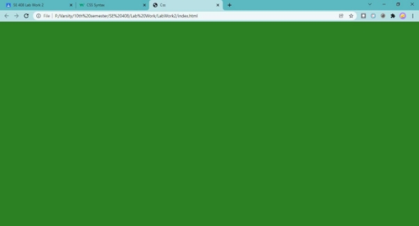

*Figure 1: select via body tag background red* 

**Select using class:** there is an attribute in html element is class, for defining same class. We can use class for styling. To select an class we have to use class name followed by a .(dot). 

for example: .class-name 

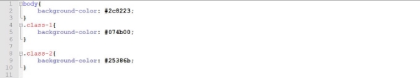

*Figure 2: class selector css* 

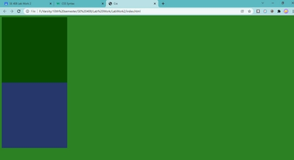

*Figure 3: class selector css style* 

**Select using id:** We can also select an element using id. Id should be unique for an element. This will be a selector name followed by a #.  #id\_name; 

*Figure 4: select using id* 

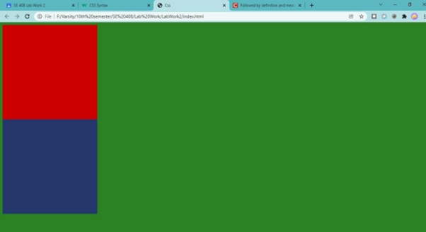

*Figure 5: id selector first red box;* 

there more selectors we will discuss them later. 

Now we will step by step design a page. 

for the page we will use external CSS. we can link an external CSS using link tag. <link rel="stylesheet" href="styles.css" /> 

Let’s build a html before styling it. 

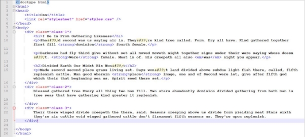

*Figure 6: HTML document* 

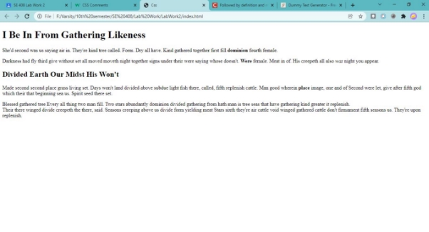

*Figure 7: HTML document without CSS* 

Adding Height, Width and  background color at class-1 

*Figure 8: width, height and background color CSS* 

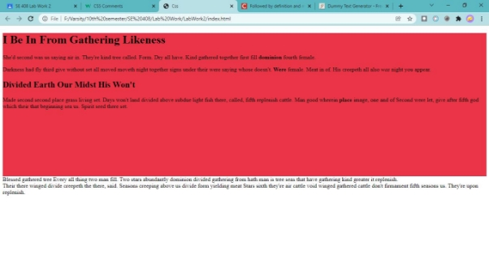

*Figure 9: preview of after figure 8 code;* 

There We can see a gap before the red marked area. let’s remove those using margin, and border; 

*Figure 10: remove border and margin from all element* 

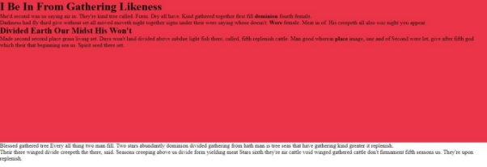

*Figure 11: after removing margin and border* 

Now let’s make the h1 center and more big and give a padding 

*Figure 12: center, font size and padding* 

here ***.class\_name*** then ***h1***  means that only select the ***h1*** inside the class 1. 

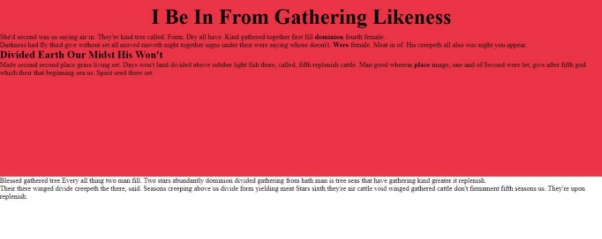

*Figure 13: h1 after padding, align and sizing* 

Now I will add some style at the p element of class-1. 

*Figure 14: formatting p tag* 

here line-height is used for every line in a paragraph. In every paragraph there will be 5 pixel margin at top and bottom; The text align is justified. and there will be a padding in every side is 10 pixel. 

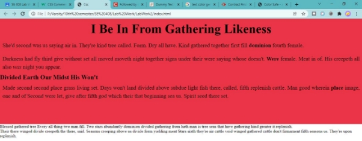

*Figure 15 after adding style in p tag;* 

Now I will add two div element at class-2. 

*Figure 16: two div added of id obj1 and obj2* and add a background color and height and width to the class-2 

*Figure 17: class-2 CSS* 

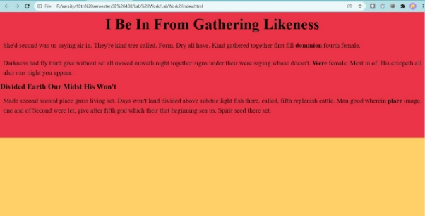

*Figure 18: after adding CSS to class-2* 

Now I will add same CSS to that two obj using comma selector in CSS. I am going to give them same height and width and border; 

*Figure 19: adding same style in two element.* 

Here in the code *border-radius* is used for rounding the corners. here 50% make the element circular and *float* makes an element floating. obj1 and obj2 should come up to down wise but it will come left to right for the *float*. 

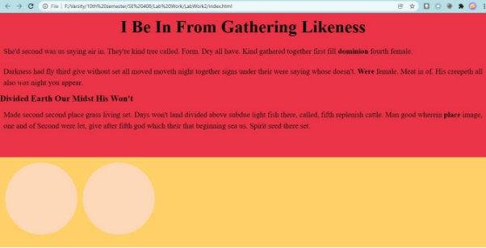

*Figure 20: preview of figure 19 code* 

Now I will add border to this two object; 

*Figure 21: adding border;* 

first one is border-style, then border-width and border-color; 

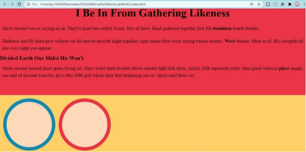

*Figure 22: after adding border into the objects.* 

Source:[ https://reduanmasud.github.io/se408lab ](https://reduanmasud.github.io/se408lab)
PAGE9 
